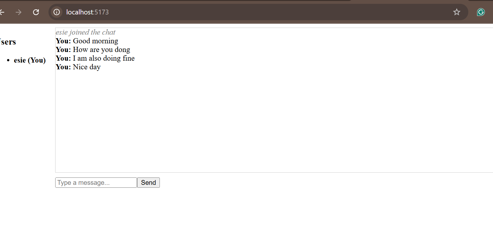

# Socket.io Real-Time Chat Application

## Features
- Real-time messaging using Socket.io
- User authentication and presence
- Multiple chat rooms or private messaging
- Real-time notifications
- Typing indicators
- (Optional) Read receipts

## Project Structure
```
socketio-chat/
├── client/                 # React front-end
│   ├── public/             # Static files
│   ├── src/                # React source code
│   │   ├── components/     # UI components
│   │   ├── context/        # React context providers
│   │   ├── pages/          # Page components
│   │   ├── socket/         # Socket.io client setup
│   │   └── App.jsx         # Main application component
│   └── package.json        # Client dependencies
├── server/                 # Node.js back-end
│   ├── server.js           # Main server file
│   └── package.json        # Server dependencies
└── README.md               # Project documentation
```

## Getting Started

### 1. Install dependencies
```
cd server
npm install
cd ../client
npm install
```

### 2. Start the server
```
cd server
npm start
```

### 3. Start the client
```
cd ../client
npm run start
```

### 4. Open the app
Go to [http://localhost:5173](http://localhost:5173) in your browser.

## Screenshots
_  _

